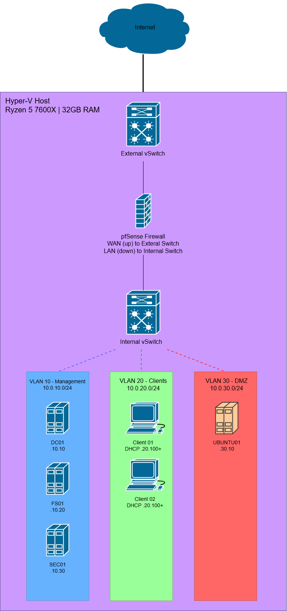

# Network Design
This virtual lab was designed to function in a college dorm. Due to the inability to control the physical network the lab is connected to, I opted to use an internal NAT design rather than bridging the VMs to the dorm's network.
A dorm's ethernet assigns an internal IP through their infrastructure when it recieves a DHCP request. The outbound traffic is NAT'd to a shared public IP. Since I want to simulate my own enterprise with a DHCP server, I need to run my own NAT network internally. This means that when my VMs get private IPs from the local DHCP inside the host, only the host will appear on the dorm's network. Not only does this give me more control over the types of services offered in the lab, it also means total isolation for the lab and not upsetting my college's network policies.

## Requirements and Goals
To accomplish this lap I needed to address the following requirements:
- Must not interfere with dorm network infrastructure
- Need isolated environment for Active Directory domain
- Require multiple network segments for realistic enterprise simulation
- Must support multiple concurrent VMs including servers and clients
- Need internet access for all VMs for updates and package downloads
- Want to practice VLAN configuration and inter-VLAN routing

## Topology Overview
The lab network is structured in three layers:

**Physical Layer:**
The physical layer of the lab network involves my Hyper-V host and its ethernet connection to my college dorm's network. Via an Extneral vSwitch configured in Hyper-V, I am able to grant internet access to virtual network.

**Gateway Layer:**
The gateway layer performs NAT translation, converting all the internal IPs to single dorm IP when traffic goes out to internet. The External vSwitch is connected to  a pfSense VM which acts as a firewall and routes traffic between VLANs allowing them to communicate with one another. It has two interfaces the WAN and the LAN. The WAN interface (connected to the External vSwitch), gets DHCP from the dorm network. The LAN interface connects to the Internal vSwitch, which acts as a gateway for the VLANs. 

**Internal Layer:**
The internal layer of the lab is structured by the Internal vSwitch which seperates 3 VLANs. The reason I chose 3 was to have a seperate VLAN for each area of the network. VLAN 10 is designated for management services, such as my domain controller, file services, and security server. VLAN 20 contains the endpoints and clients. VLAN 30 is the demilitarized zone (DMZ) and holds the Ubuntu server running web services or containers. This ensures that if the machine is compromised it can't directly access the other servers and it more accurately simulates real enterprise network architecture. 

## IP Addressing Scheme
### VLAN 10 - Management/Servers (10.0.10.0/24)
| IP Address    | Hostname  | Purpose                          |
|---------------|-----------|----------------------------------|
| 10.0.10.1     | pfSense   | Gateway                          |
| 10.0.10.10    | DC01      | Domain Controller, DNS           |
| 10.0.10.20    | FS01      | File Server, DFS                 |
| 10.0.10.30    | SEC01     | WSUS, Certificate Services, NPS  |
| 10.0.10.100-200 | N/A     | DHCP Pool (Reserved)             |

### VLAN 20 - Clients (10.0.20.0/24)
| IP Address    | Hostname  | Purpose                          |
|---------------|-----------|----------------------------------|
| 10.0.20.1     | pfSense   | Gateway                          |
| 10.0.20.100-200 | Clients | DHCP Pool for workstations       |

### VLAN 30 - DMZ (10.0.30.0/24)
| IP Address    | Hostname  | Purpose                          |
|---------------|-----------|----------------------------------|
| 10.0.30.1     | pfSense   | Gateway                          |
| 10.0.30.10    | UBUNTU01  | Linux Server - Web services, Docker |
| 10.0.30.20-50 | N/A       | Reserved for additional DMZ services|

**Design Rationale:**
    - The reason I used 10.0.x.x network was to make understanding the enterprise network easier. It was easy to remember which VMs had what address based on the service they offered or the VLAN they belonged to.
    - I left some gaps between the server IPs rather than going from 10.10 to 10.11, this was in case I wanted to add multiple servers of that type further down the road. For example if I wanted to add a second file server (FS02) it would ne assigned 10.21.
    - The DHCP ranges start at .100 to create a clear seperation between the statiic and dynamic addresses. The IPs from .1 to .99 are reserved for infrastructure devices and servers that need consistent addresses.This makes the network management much easier.

## VLAN Configuration
The VLANS are configured and tagged on pfSense which handles the inter-VLAN routing. Without VLANs, everything would be on one unsegmented network making it messy to manage and harder to secure.

**VLAN 10 - Management**
Purpose of this VLAN is to house critical enterprise infrastructure and domain services. It will contain a domain controller, file server, and security server. The reason these are isolated together is that they all deal with the management of clients making the network more organized. 

**VLAN 20 - Clients**
Purpose of this VLAN is to house all endpoints or clients of the network. These are isolated because they erquire different security policies to limit what the workstations can access.

**VLAN 30 - DMZ**
Purpose of the VLAN is to create an isolated zone that can't compromise the other devices. It houses an Ubuntu Server running web services. If the server were to be hacked, the hacker would not be able to pivot to the domain controller. This simulates real enterprise where public-facing services are isolated.

## Routing & Firewall Rules
By default, pfSense blocks all traffic between VLANs. The following rules are configured:

**VLAN 20 (Clients) → VLAN 10 (Management):**
- Allow DNS (port 53) - Clients need DNS from DC01
- Allow Kerberos (port 88) - Domain authentication
- Allow LDAP (ports 389, 636) - Active Directory queries
- Allow SMB (port 445) - Access to file shares
- Allow RDP (port 3389) - Remote management of servers

**VLAN 10 (Management) → All VLANs:**
- Allow all traffic - Servers need to manage/monitor entire network

**All VLANs → WAN:**
- Allow HTTP/HTTPS (80, 443) - Internet access for updates
- Allow DNS (53) - External DNS queries

**VLAN 30 (DMZ) → VLAN 10/20:**
- DENY by default - DMZ should not initiate connections to internal networks