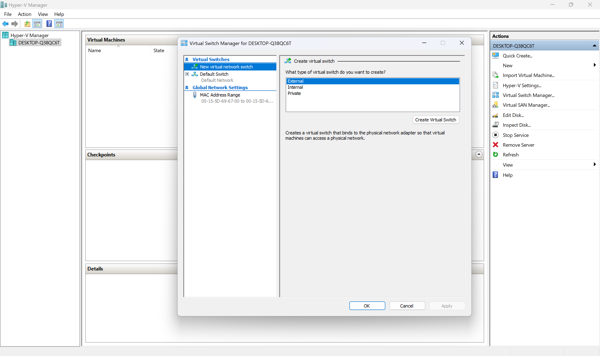
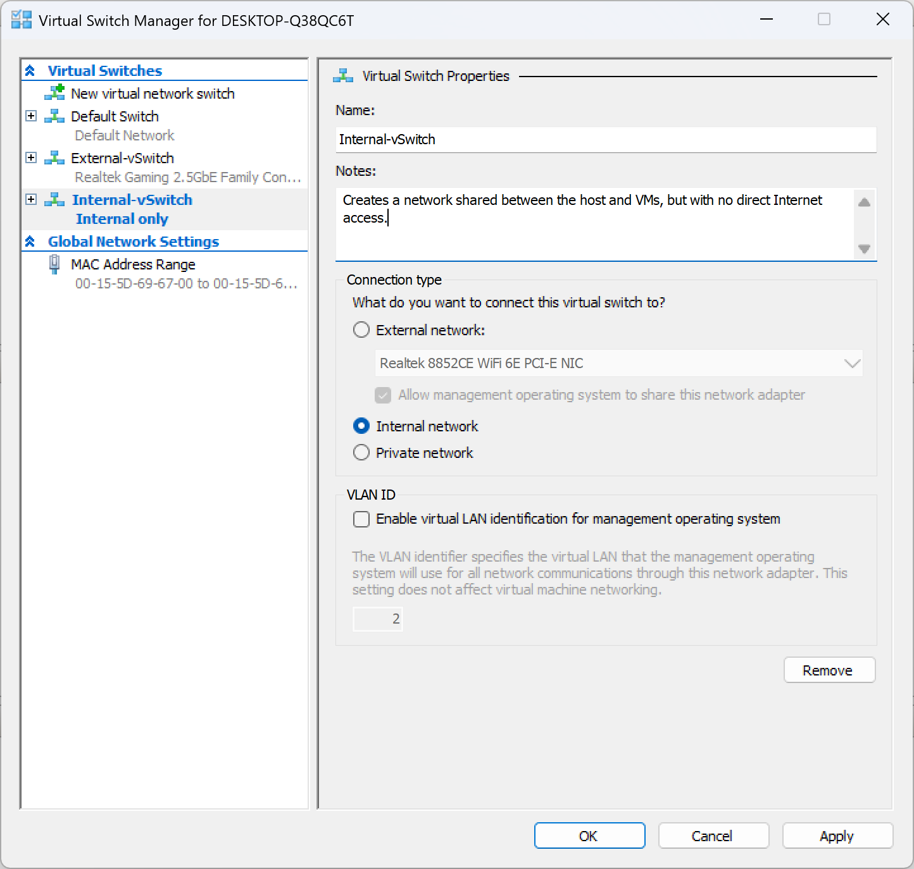

# Hyper-V Setup

## Host Configuration
**Host Specifications**
- CPU: AMD Ryzen 5 7600X
- RAM: 32GB
- Storage: 1TB M.2 SSD / 537GB Free
- OS: Windows 11 N Education
- Hyper-V Version: 10.0.26100.5074

## Virtual Switch Creation
Virtual switches in Hyper-V allow VMs to communicate with each other and external networks. For this lab, I created two virtual switches with different purposes.

### External Virtual Switch
The External switch is meant to connect pfSense's WAN interface to the physical dorm network.

**Configuration Steps:**
1. Opened Hyper-V Manager → Virtual Switch Manager

2. Created new External virtual switch
3. Named it "External-vSwitch"
4. Bound to physical Ethernet adapter: Realtek Gaming 2.5GbE Family Controller

5. Apply

### Internal Virtual Switch
The Intneral switch acts as a L2 switch, connecting the VMs to one another and carrying VLAN-tagged traffic.

**Configuration Steps:**
1. Selected "New virtual network switch"
2. Created new Internal virtual switch
3. Named it "Internal-vSwitch"

4. Apply

## Resource Allocation
With 32GB of total RAM, I allocated resources across all VMs to ensure stable performance while leaving headroom for the host OS.

| VM Name   | Purpose                  | vCPUs | RAM   | Storage |
|-----------|--------------------------|-------|-------|---------|
| pfSense   | Firewall/Router          | 2     | 2GB   | 20GB    |
| DC01      | Domain Controller        | 2     | 4GB   | 60GB    |
| FS01      | File Server              | 2     | 3GB   | 100GB   |
| SEC01     | Security Server          | 2     | 3GB   | 60GB    |
| UBUNTU01  | Linux Server             | 2     | 2GB   | 40GB    |
| CLIENT01  | Windows Workstation      | 2     | 4GB   | 60GB    |
| CLIENT02  | Windows Workstation      | 2     | 4GB   | 60GB    |

**Total Allocated:** ~22-24GB RAM (depending on what's running)
**Host OS Reserved:** ~8-10GB for Windows and Hyper-V overhead

**Design Rationale:**
This lab is not designed to run all at once; instead clients will be spun up when they are needed for testing the lab. The lighter VMs are designated less RAM. For example pfSense is extremely lightweight as it only performs routing, NAT, and firewall rules. Same goes for the Linux server. The File server and Security server, while more demanding than pfSense or UBUNTU01, still do not need much to run their services. The Domain controller will be using multiple services at once and so it needs as much RAM as can be allocated. As a Windows workstation needs a minimum of 4GB RAM to run, that is what was allocated to the clients. 
Hyper-V does support dynamically allocated RAM, however I chose a fixed allocation so that I can be specific about which machines get what. Dynamic RAM in Hyper-V can also cause issues with domain controllers and causes memory pressure/swapping that degrades performance.
Giving each of the VMs 2 vCPUs allows them to run more modern workloads suffieciently. The 7600X has 6 cores/12 threads, so distributing 2 cores to each VM works fine. Hyper-V also oversubscribes and shares CPU time efficiently among running VMs.
As for storage, each VM is allocated enough based on server needs while also being limited to my disk space. For example, in a real enterprise network a file server could have tens of terabytes of storage, but mine just has 100GB allocated.